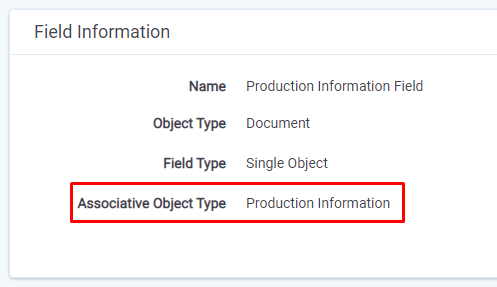
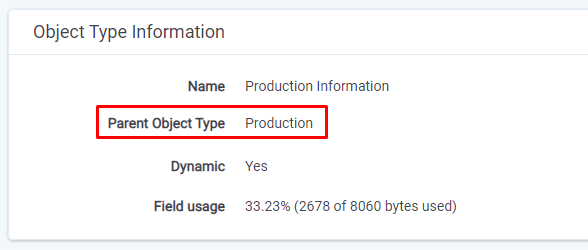
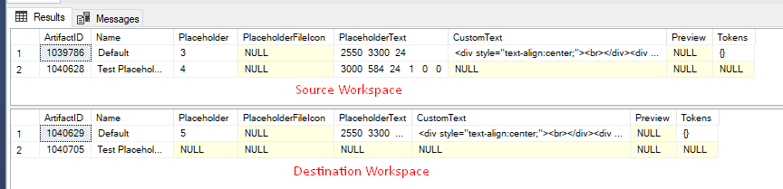
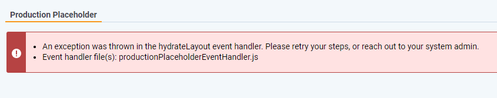
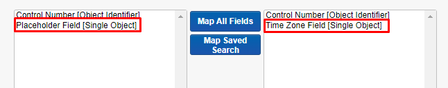
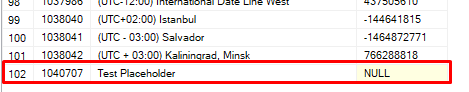

# Title

## Status

Proposed

## Context

Problem with pushing Single/Multi Object fields with Sync is the legend. Everyone heard that it doesn't work and was never supported in RIP due IAPI limitations, but till now we still don't know where the problem really is. Goal of this document is to guide management team and give them overview about the gaps and potential improvements. Thanks to that they could start the talks with the clients about their expectations associated with it.

## Problem Statement

### Object Fields with parent object different than workspace end up with Item Level Error

The most common error is when the mapped single/multi object field in **Destination Workspace** has **Associative Object Type** set to object which has Parent Object different than Workspace. If user tries to push following field the job ends up with Item Level Errors for documents which have values set in this field:

> IAPI  - 20.006. Failed to copy source field into destination field due to missing child object. Review the following destination field(s): '<FIELD_NAME>'

Example:

In Splunk we observed **52** jobs where those item level errors occurred in last 90 days. Splunk query is listed below:

``
index="rel_logging_prod" "Properties.Application"="dcf6e9d1-22b6-4da3-98f6-41381e93c30c" "Failed to copy source field into destination field due to missing child object"
``

**Solution:**

First of all we need to understand client expectations and motivation for what they need those fields. One of the solutions could be  re-creation parent object instance to which we could link pushed fields. In above example it would be instance of _Production_ object.

_Note: It requires more investigation because I believe that the ArtifactID value must be the same._

### Pushed objects are created as "blown eggs" in destination workspace

Another functional gap in Single/Multi Object Sync flow are "blown eggs" created in destination workspace. Right now if following Single/Multi Object doesn't exist in destination workspace IAPI creates simple ArtifactID-Name object to satisfy the import. The job will pass and the value will be visible on Document tabe, but created object is "broken" and unusable.

Example:

For some objects (due to UI validation) and required values the created object is broken and can't be even updated on the UI:

### There are any limitations in mapping Single/Multi Objects

It's combination of two above statement, but right now there are no limitations during mapping Single/Multi Objects fields to each other during Integration Point configuration:

What only needs to be satisfied are the conditions "Single Object to Single Object" or "Multi Object to Multi Object". After running following Integration Point we end up with following object in Destination Workspace:

## Summary

After analysis it seems that main problem reside in "blown egg" objects which often don't have Parent Object which leads to Item Level Errors. There are couple of questions we need to answer before we start technical analysis.

1. What should we do when Paren Object doesn't exist?

    * Re-create whole Parent Object? - It may be hard due to various nature of the objects (some artifact ids are pointing to another objects etc. - we cannot just take Artifact ID written in column).

    * Create "blown egg" Parent Object - we satisfy the IAPI requirements, but still the objects will be completely unusable.

2. For what client needs those object for?

3. Should we improve the fields mapping validation?

4. One of the "Legend Problems" was - "Single/Multi Objects fail the job". We need to confirm if this statement is still true, because what I was able to do during testing was only create Item Level Errors

## Thoughts

If we would like to get rid off "blown eggs" and create fully functional objects it would require huge amount of work not only from our side, but also from other teams, because due to specific nature of each application-related objects the approach for re-creation would be different for many of them. But on the other side, if we could encourage others to implement the "re-creation" logic we could thanks to that eliminate current functional gap in Non-Document object flow, because we could re-use this logic to recreate fully functional objects in Destination Workspace (STRs etc.)

## References

Here are some old docs and found JIRAs related to this topc:

* <https://einstein.kcura.com/display/DTV/RIP+Sync+-+Fields+Mapping+-+Multi+Object+Fields>
* <https://jira.kcura.com/browse/REL-334542>
* <https://jira.kcura.com/browse/REL-334567>
* <https://einstein.kcura.com/display/DTV/RIP+Sync+-+Fields+Mapping>
* <https://einstein.kcura.com/pages/viewpage.action?pageId=301579040>
* <https://einstein.kcura.com/display/DV/Spike%3A+Multi+-+Object+fields+with+an+associated+object+type+of+Folder>
