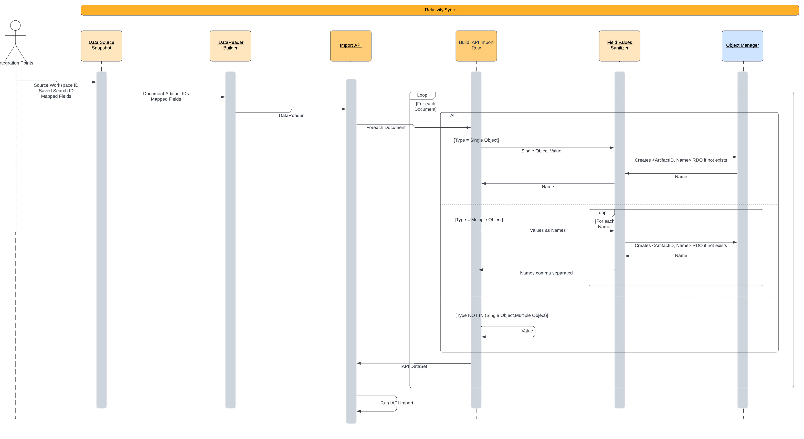
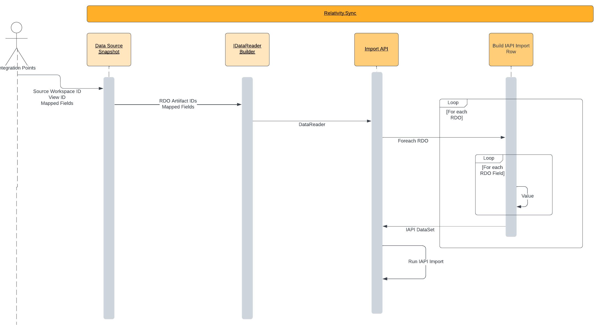

# Sync.RDO.Plugin for RDOs Rescue

## Status

Proposed

## Context

At the end of Q1 we released **SYNC Non-Documents Flow** ([Non-Doc ADR](./%5BADR13%5D%20Import_non_document_objects.md)). It enable customers to push RDOs between workspaces. The biggest drawback is that the objects are pushed blindly - there is no data correctness checks. Due to that the flow is unusable with RDOs on which clients care most (Analytics, STRs, Productions, Integration Points Profiles) - In general all RDOs which have dependencies to ArtifactIDs won't work in Destination Workspace

The second issue we noticed is related to Single/Multi Objects push between workspaces - [Single/Multi Object Problem Statement](./%5BADR17%5D%20Single_Multi_Objects_Problem_Statement.md). The objects re-created in Destination Workspace are blown egss, which cannot be used - sometimes they cannot be even opened/edited (details in above ADR).

Based on that we plan to introduce the mechanism which shift the "RDO re-creation" during SYNC job to the RDO-Owner who has most detailed knowledge about RDO structure and have best tools to re-create fully operational objects in Destination Workspace

## Current Design

Problem statement and current architecture can be divided into two separate problems which will be described below

### SYNC Single/Multi Object Architecture

Architecture is relied on IAPI Import job where we get Document IDs from Saved Search and build our own `IDataReader` implementation in which we handle Non-Standard fields types manually e.g. [MultiObjectFieldSanitizer.cs](https://git.kcura.com/projects/DTX/repos/relativitysync/browse/Source/Relativity.Sync/Transfer/MultipleObjectFieldSanitizer.cs).

Linking is based on **Name** property, so if in Destination Workspace the RDO with this Name already exists it won't be created and Document in Destination Workspace will be linked with this RDO.

As mentioned above the main problems are:

* RDOs which have Parent Object different than Workspace cannot be created by Object Manager, because following Parent Object doesn't exist in Destination Workspace
* RDOs are created as blown eggs - **ArtifactID<->Name** pair which satisfy Document View, but those created objects are completely unusable

_Diagram 1. Single/Multi Object Architecture_


### SYNC Non-Document Object Architecture

By Non-Document Objects we mean all RDOs except Document. This flow is quite similar standard Documents push between workspace. What differs both flows is Data Source, where for RDOs we take the IDs from View. Under the hood we still use NonDocument Import API Job.

Main issue with current approach is that we blindly copy column values between workspaces so the Artifact IDs to reference objects are not validated. Due to that we get not fully operational RDOs.

_Diagram 2. Non-Document SYNC Architecture_


## Proposed Design with Relativity.Sync.RDO.Plugin

To fullfill above issues with RDOs push between workspaces we are going to invent _Relativity.Sync.RDO.Plugin_ (naming can vary), which move the re-creation responsibility to the RDOs owners.

Why? - Because RDOs owners have best knowledge about RDO structure and how it should be re-created based on existing one.

We introduced thin interface:

```cs
public interface IRDOSyncHandler
{
    Task<NamedArtifactObject> CopyObjectAsync(int artifactID, int parentArtifactID, int sourceWorkspaceID, int destinationWorkspaceID);

    Task PingAsync();
}

public class NamedArtifactObject
{
    public string Name { get; set; }

    public int ArtifactID { get; set; }

    public int ParentArtifactID { get; set; }
}
```

This method will be called in Kepler based on agreed **route naming convention** where the prefix will be static across all implementations, but the routes will be differ by **RDO Guid**. Route is not determined yet and is under construction, but for need of this document let's assume following route:

> /Relativity.Sync.RDO.Plugin/Copy/<RDO_ArtifactID>

Example Kepler interface:

```cs
namespace Product.Feature.Service
{
    [WebService("MyKeplerService")]
    [ServiceAudience(Audience.Public)]
    [RoutePrefix("Relativity.Sync.RDO.Plugin/<RDO_ArtifactID>")]
    public interface IExampleService : IRDOSyncHandler, IDisposable
    {
        [Route("Copy")]
        Task<NamedArtifactObject> CopyObjectAsync(int artifactID, int parentArtifactID, int sourceWorkspaceID, int destinationWorkspaceID);

        [Route("Ping")]
        Task PingAsync();
    }
}
```

In Relativity.Sync we would check if the endpoint was implemented and if we get 404 as response from `PingAsync` we just run standard code flow described above. For impelemented RDOs (`PingAsync` returns 200) we run `CopyObjectAsync` with all required parameters. With all those information RDO owner will be able to re-create the RDO based on `artifactID` and `parentArtifactID` in Destination Workspace and after that Relativity.Sync just link the created RDO with Document.

### Caching

To avoid multiple objects creation we introduce caching mechanism on two different levels.

* Caching for pushed RDOs - every created RDO would be cached as _SourceRDOArtifactID <-> CreatedDestinationRDOArtifactID_ thanks to that we could link directly objects which were already created to not duplicate them.

* Caching for Parent RDO - in case of parent re-creation we could cache created RDO object _SourceParentRDOArtifactID <-> CreatedDestinationParentRDOArtifactID_ and then for next docs pass _CreatedDestinationParentRDOArtifactID_ as `parentArtifactID` parameter to method to let the client know which child RDO should be linked with.

_Diagram 3. Sync.RDO.Plugin flow:_


## Integration Tests

We are going to create thin test framework package which enable you to test your integration with least possible effort and pin it into nightly/PR builds

## Thought process behind a scenes

### Should mapping be disabled for integrated RDOs?

Right now in Non-Document flow client can choose which RDO fields he wants to push. But after the integration this requirement seem to be irrelevant anymore because we re-create whole RDOs in destination workspace. We thought about it in case of fields e.g. _Notes_, _Description_ which perhaps are not needed in re-creation - **We are more convinced of mapping disable because it decrease complexity**

### Re-create on client side vs re-create in Sync

RDO re-creation can be located in client's kepler and we would receive only `NamedArtifactObject` or client's kepler could return the paylod with re-create information which we could use in ObjectManager to re-create the object. The second approach would take off create responsibility from the client, but on the other hand we would need to somehow determine if payload is still up to date with current RDO structure and we would be strictly coupled to Object Manager Create Request. Thanks to approach with re-create on client side, the client can re-use his own implemented methods/keplers to satisfy the requirements.

### URL convention vs EventHandler registration

Our intention was that the integration should be as simple as possible and require at least effort from your side. This is the reason why we throw away EH registration, moreove some of the teams doesn't have EH anymore.

### What if transferred RDO has different parent than Workspace

As we know right now this is our pain point in current implementation because RDOs with parent different than Workspace cannot be re-created because in destination there is no parent RDO with which we can link newly created objects. We decided to leave the end decision to client side by passing `parentArtifactID` argument in `CopyObjectAsync` method. Thanks to that you'll decide how you want to approach this. Here is the example for _Production Set_ and _Production Data Source_:

> Let's imagine that user wants to push documents between workspaces with mapped field - Single Object which is type of _Production Data Source_ (e.g. user stores information that following doc was produced from this Production Data Source). In current implementation following document ends up with Item Level Error - Parent RDO does not exist in destination workspace, but if _Production Data Source_ RDO would be integrated the RDO owner could decide what to do in this case, because SYNC would run `CopyObjectAsync(<ProductionDataSourceID>, <ProductionSetID>, <SourceWorkspaceID>,<DestinationWorksapceID>)` and the RDO owner could decide if he wants to re-create whole Production Set and Production Data Source under it or choose different approach.

## Next Steps

1. We want to share this doc with our collegues from other Teams, who would be interested with this integration. We want to hear your feedback and potential pitfalls which we didn't cover or we are not aware of

2. We are going to introduce metrics especially for Single/Multi Objects which expose Object Types which are mapped most.

3. After determining final design we plan to go with pilot to integrate Sync.RDO.Plugin with _Integration Points Profile_ RDO which we owns to field test the feature and validate approach in practice.

4. Once we release _Integration Points Profile_ RDO integration, we start to work with volontiers to support them with the integration

## FAQ

### **1. What we benefit from the Sync.RDO.Plugin integration?**

Thanks to the Sync.RDO.Plugin integration your team fully benefit from SYNC Non-Document Object push between workspaces. No more manual re-creation in Destination Workspace - client would need only to run SYNC job and push RDOs to desired workspace.

### **2. How the keplers would be called dynamically?**

We are going to implement thin HttpClient implementation with retry logic which enable us to run custom HTTP requests.

### **3. We have more than one RDO which requires integration. Would it be possible?**

Yes. What you would need to do is create another kepler with different RDO Guid suffix.

### **4. What if our code throws**

We are going to catch every thrown exception and report the whole item as Item Level Error (which only fails this document/RDO not the whole job). We plan to monitor the metrics and in case of exceptions notify you about failures. Beside that whole feature (Sync.RDO.Plugin) will be hidden behind a toggle so in case of fatal errors we just disable it and revert to old code flows

### **5. Who is the code owner**

RIP/Sync Team owns whole infrastructure and ensure that the keplers calls, error handling and caching works properly, **but the kepler implementation is owned by you**.
