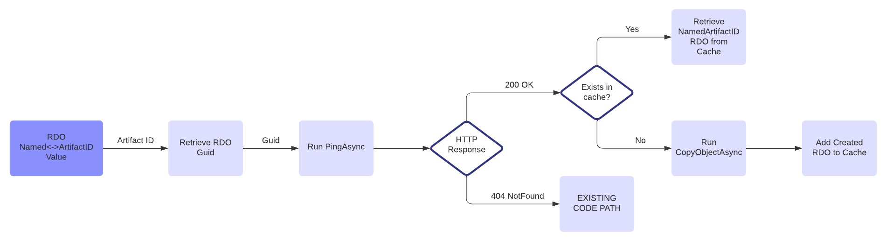

# Sync.Plugin for RDOs Rescue

## Status

Proposed

## Context

At the end of Q1 we released **SYNC Non-Documents Flow** ([Non-Doc ADR](./%5BADR13%5D%20Import_non_document_objects.md)). It enable customers to push RDOs between workspaces. The biggest drawback is that the objects are pushed blindly - there is no data correctness checks. Due to that the flow is unusable with RDOs on which clients care most (Analytics, STRs, Productions, Integration Points Profiles) - In general all RDOs which have dependencies to ArtifactID won't work in Destination Workspace

The second issue we noticed is related to Single/Multi Objects push between workspaces - [Single/Multi Object Problem Statement](./%5BADR17%5D%20Single_Multi_Objects_Problem_Statement.md). The objects re-created in Destination Workspace are blown egss, which cannot be used - sometimes they cannot be even opened/edited (details in above ADR).

Based on that we plan to introduce the mechanism which shift the "RDO re-creation" during SYNC job to the RDO-Owner who has most detailed knowledge about RDO structure and have best tools to re-create fully operational objects in Destination Workspace

## Current Design

Problem statement and current architecture can be divided into two separate problems which will be described below

### SYNC Single/Multi Object Architecture

Architecture is relied on IAPI Import job where we get Document IDs from Saved Search and build our own `IDataReader` implementation in which we handle Non-Standard fields types manually e.g. [MultiObjectFieldSanitizer.cs](https://git.kcura.com/projects/DTX/repos/relativitysync/browse/Source/Relativity.Sync/Transfer/MultipleObjectFieldSanitizer.cs).

Linking is based on **Name** property, so if in Destination Workspace the RDO with this Name already exists it won't be created and Document in Destination Workspace will be linked with this RDO.

As mentioned above the main problems are:

* RDOs which have Parent Object different than Workspace cannot be created by Object Manager, because following Parent Object doesn't exist in Destination Workspace
* RDOs are created as blown eggs - **ArtifactID<->Name** pair which satisfy Document View, but those created objects are completely unusable

_Diagram 1. Single/Multi Object Architecture_


### SYNC Non-Document Object Architecture

By Non-Document Objects we mean all RDOs except Document. This flow is quite similar standard Documents push between workspace. What differs both flows is Data Source, where for RDOs we take the IDs from View. Under the hood we still use NonDocument Import API Job.

Main issue with current approach is that we blindly copy column values between workspaces so the Artifact IDs to reference objects are not validated. Due to that we get not fully operational RDO.

_Diagram 2. Non-Document SYNC Architecture_


## Proposed Design with Relativity.Sync.Plugin

To fullfill above issues with RDOs push between workspaces we are going to invent _Relativity.Sync.Plugin_ (naming can vary), which move the re-creation responsibility to the owners RDOs owners.

Why? - Because RDOs owners have best knowledge about RDO structure and how it should be re-created based on existing one.

We introduce thin interface:

```cs
public interface IRDOSyncHandler
{
    Task<NamedArtifactObject> CopyObjectAsync(int artifactID, int parentArtifactID, int sourceWorkspaceID, int destinationWorkspaceID);

    Task PingAsync();
}
```

This method will be called in Kepler based on agreed **route naming convention** where the prefix will be static across all implementations, but the routes will be differ by **RDO Guid**. Route is not determined yet and is under construction, but for need of this document let's assume following route:

> /Relativity.Sync.Plugin/Copy/<RDO_ArtifactID>

Example Kepler interface:

```cs
namespace Product.Feature.Service
{
    [WebService("MyKeplerService")]
    [ServiceAudience(Audience.Public)]
    [RoutePrefix("Relativity.Sync.Plugin/<RDO_ArtifactID>")]
    public interface IExampleService : IRDOSyncHandler, IDisposable
    {
        [Route("Copy")]
        Task<NamedArtifactObject> CopyObjectAsync(int artifactID, int parentArtifactID, int sourceWorkspaceID, int destinationWorkspaceID);

        [Route("Ping")]
        Task PingAsync();
    }
}
```

In Relativity.Sync we would check if the endpoint was implemented and if we get 404 as response from `PingAsync` we just run standard code flow described above. For impelemented RDOs (`PingAsync` returns 200) we run `CopyObjectAsync` with all required parameters. With all those information RDO owner will be able to re-create the RDO based on `artifactID` and `parentArtifactID` in Destination Workspace and after that Relativity.Sync just link the created RDO with Document.

_Diagram 3. Sync.Plugin flow:_


## Decision

## Consequences

What becomes easier or more difficult to do because of this change?
